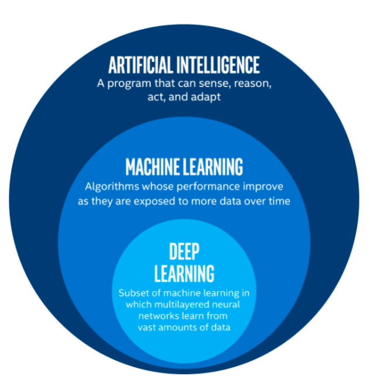
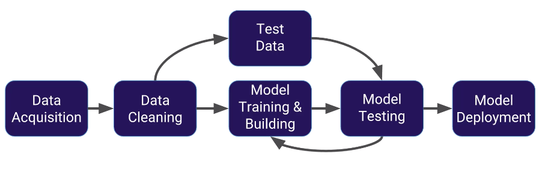
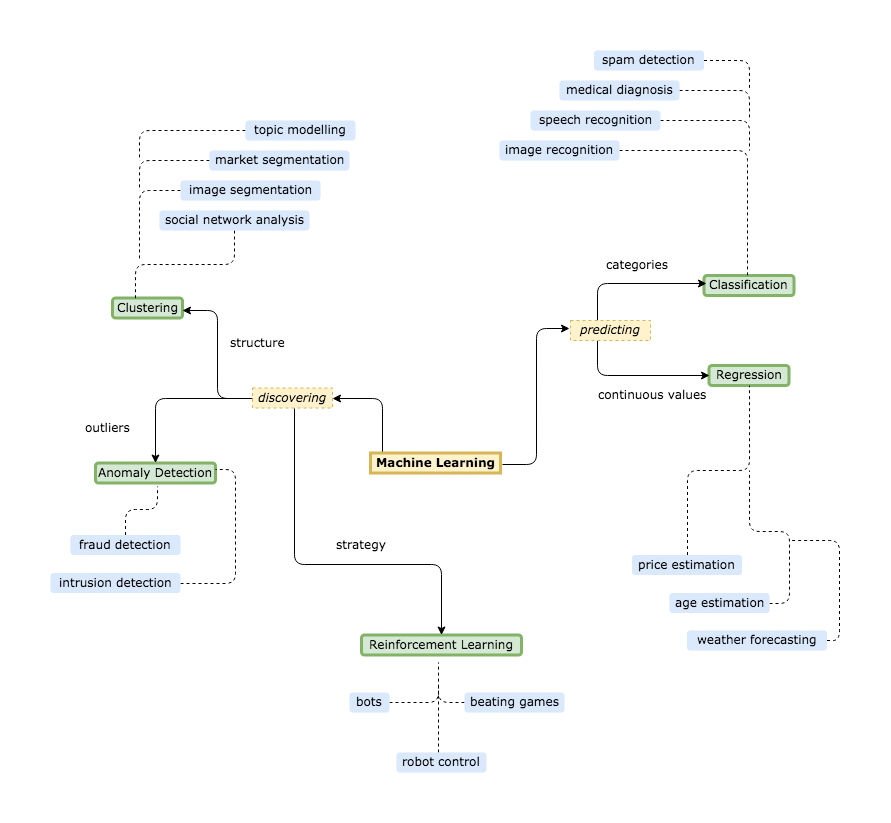

# Create your first ML Model

In this workshop we will explore one of the "Hello-World" datasets of machine learning, the Titanic dataset. This was also a challenge on [Kaggle](https://www.kaggle.com/competitions/titanic/overview).

Overview:

* Dataset: Titanic passengers
* ML library: scikit-learn
* Visualization Library: seaborn
* Notebook: Jupyter

## Setup

1. check if all neccessary libraries are installed:

```
pip3 install sklearn seaborn
```

2. In your user-folder, download the neccessary files:

```
git clone https://github.com/flopach/ml-titanic
```

3. Start the Python notebook in the browser and open the Python Notebook:

```
jupyter-notebook
```

## About Machine Learning

### AI, ML, DL Difference



### ML Process



### Algorithms Overview



